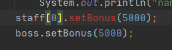
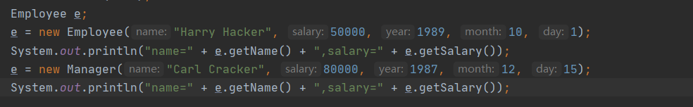
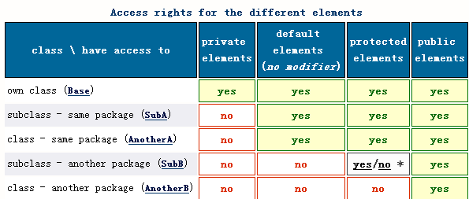
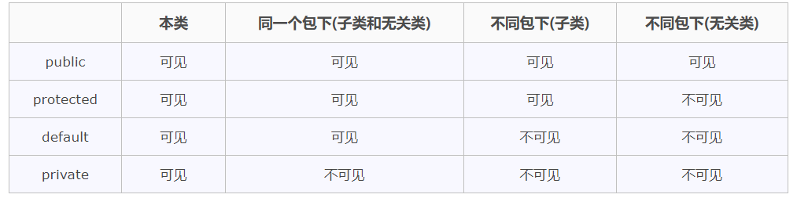

# 类和对象
## 类的定义及使用
### 类的定义
类是构造对象的模板和蓝图
* 由类构造对象的过程称为"创建类的实例(instance)"
* 封装(亦称为数据隐藏),就是将数据和行为组合到一个包(package)中，并对对象的使用者隐藏具体的实现方式。
**封装是处理对象的一个重要概念。**
* 对象中的数据称为实例字段(instance field)
* 操作数据的方法称为方法(method)，C++中使用函数实现
* 状态(state)是当前对象的所有当前状态的集合
* 通过扩展一个类来建立另外一个新类的过程称为继承(inheritance),**值得注意的是继承一般会是一个更特殊的类继承一个更一般的类，同时会增加一些新的方法来处理所需的需求.**


### 对象
对象是包含对用户公开的特定功能部分和隐藏的实现部分的集合
* 每个对象都有三个主要特性
````
* 对象的行为（behavior）
* 对象的状态（state）
* 对象的标识（identity）
````
对应到Java中，分别是
````
行为 -> 可调用的方法 methods
状态 -> 描述当前状况的信息，比如各种变量
标识 -> 对象(或称对象实例)的名称
````
**要注意的的是对象的状态会随着时间而发生改变，这种改变不能是自发的，否则就破坏了封装性**


### 类的使用
Java中，使用构造器(constructor,或称构造函数)来构造对象实例。
* 构造器可以构造并初始化对象
* 构造器名字与类名相同，使用时在构造器前加上new操作符，如下：
```Java
new Date();
```
* 构造器构造出对象后，可以用一个对象变量来引用他，便于以后继续使用
```Java
Date birthday = new Date();

//继续使用
System.out.println(birthday);
```
* 对象变量(如birthday)不是对象，实际上若没有对其指定初始状态（即赋初值），其就没有引用任何对象，这时就不能对这个对象变量使用对象(Date)可使用的方法.
若要使用则必须先初始化，有两种初始化方法
```Java
deadline = new Date();

//让它引用一个已有对象
deadline = birthday;
```
* 可以显式的将对象变量设置为null表示其目前没有引用任何对象
```Java
deadline = null;
```
* 所有的Java对象都储存在堆上，当一个对象包含另外一个对象变量时，它只是包含了指向另外一个堆对象的指针。

### 静态工厂方法(factory method)
* 封装的意义就在于程序员不用考虑其内部的实例字段和具体方法实现，只需要考虑类对外提供的方法。
* 更改器方法和访问器方法
    * 更改器方法会修改对象的状态
    * 访问器方法只访问对象而不修改对象
### LocalDate类和Date类
```Java
//java.time.LocalDate;

//构造一个表示当前日期的对象
static LocalDate now()
//构造一个表现给定日期的对象，如1997-12-7
static LocalDate of(int year,int month,int day)
//得到当前日期的年月日
int getYear()
int getMonthValue()
int getDayofMonth()

//得到当前日期是星期几，作为DayOfWeek的一个对象实例返回，
//调用getValue来得到1-7之间的一个数，表示这是星期几
//1表示星期1,7表现星期日
DayOfWeek getDayOfWeek
//eg.
if(date.getDayOfWeek().getValue == 1){ System.out.println("今天星期1")}

//生成当前日期之后或者之前n天的日期
LocalDate plusDays(int n)//之后n天
LocalDate minusDays(int n)//之前n天

```
```Java
import java.time.*;

/**
 * @version 1.5 2015-05-08
 * @author Cay Horstmann
 * 这个示例展示了然后使用一个类的接口来完成相当复杂的任务如日历表，而不需要考虑具体实现，只需要使用import导入
 */
public class CalendarTest
{
   public static void main(String[] args)
   {
      LocalDate date = LocalDate.now();
      int month = date.getMonthValue();
      int today = date.getDayOfMonth();

      //假如今天4号，today=4,
      // 4-1=3,
      // date.minusDays(3)意思是今天之前3天的日期，即1号
      date = date.minusDays(today - 1); // set to start of month
      
      //得到这个月的第一天是星期几
      //今天4号，对应是星期日，
      // 这个月的第一天是星期4，即value=4
      DayOfWeek weekday = date.getDayOfWeek();
      int value = weekday.getValue(); // 1 = Monday, . . . , 7 = Sunday
      

      //打印日历中第一行的缩进，和表头
      System.out.println("Mon Tue Wed Thu Fri Sat Sun");
      for (int i = 1; i < value; i++)
         System.out.print("    ");
      
      //循环条件内设置，只打印当前月份的，到了下个月则循环结束
      //因为我们不知道这个月有几天，那就设置date还在当前月份就继续迭代打印
      while (date.getMonthValue() == month)
      {
         System.out.printf("%3d", date.getDayOfMonth());
         //如果打印到当前日期 如4号，则用一个*标记
         if (date.getDayOfMonth() == today)
            System.out.print("*");
         else
            System.out.print(" ");
         
         //日期加一天，并且当加到了下一个星期1时，自动换行
         date = date.plusDays(1);
         if (date.getDayOfWeek().getValue() == 1) System.out.println();
      }
      //循环体结束时，date应该是11月1日，星期日，所以要打印一个换行符结束
      //如果正好这天是星期1，之前的循环体最后已经打印过一个换行符，则不需要再次打印一个
      if (date.getDayOfWeek().getValue() != 1) System.out.println();
   }
}

```
### 多个源文件
* 可以任务Java的编译器内置了Unix或者Windows的make功能
* 多个源文件编译有两种命令格式.
其中第二钟方式没有显式地编译Employee.java,但当Java编译器发现EmployeeTest.java使用了Employee类时，他会自动查找Employee.class文件，
如果没找到，就会寻找Employee.java并对它进行编译
````
javac Employee*.java
//或者
javac EmployeeTest.java
````
### 构造器
* Java中的构造器总是要和new操作符一起使用，因为所有的Java对象都是在堆上构造的。初学者最容易犯的错误是忘记new操作符
### var,声明局部变量
* Java10中薪增了一个var关键字，用于声明局部变量，如果可以从变量的初始值直接推导出他们的类型，则无须在等号左侧指定类型，这种情况下可以使用var关键字
* 要注意的是对应基本数值类型，如int，long，double。最好不要滥用var关键字，建议少用或者不用，以此帮你你培养对数值精度的敏感性。
```Java
//例如
Employee harry = new Employee("Harry Hacker",50000,1989,10,1);
//可以写成以下代码
var harry = new Employee("Harry Hacker",50000,1989,10,1);

```
### 使用null 引用
### 类的访问权限
#### 私有方法
#### final实例字段
## 静态属性和方法
### 静态字段
如果将一个字段定义为static，这个字段就成为这个类所有对象共享访问的唯一标识码.<br>
静态字段也被成为类字段，“静态”是沿用了C++的叫法，无实际意义。

### 静态常量
静态常量经常使用，如Math类中定义了一个静态常量PI
```Java
public class Math{
...
public static final double PI = 3.14;
...
}
```
在程序中访问静态常量可以通过Math.PI访问
类似的System.out中也有静态常量即 System.out.PrintStream
#### 原生方法
即不是在Java语言中实现的方法，可以绕过Java的访问控制机制,实现修改final变量的值


### 静态方法
静态方法即不在对象上执行的方法，一般通过**类名.方法**的方式调用
```Java
Math.pow(x,a)
```
* 也可以使用对象来调用静态方法(例如用harr.getNextId()代替Employee.getNextId())，这是合法的。但这种写法容易造成阅读上的语义混淆，不建议这样写
下面两种情况下可以使用静态方法：
* 方法不需要访问对象状态，因为这个方法所需要的所有参赛都显式的通过传入的参数提供，如Math.pow()
* 方法只需要访问类的静态字段，如Employee.getNextId()
#### 工厂方法
静态方法的另外一种常见用途就是静态工厂方法(factory method)
```Java
LocalDate.now()
LocalDate.of()
```
下面给出常见的工厂方法的调用
```Java
NumberFormat currencyFormatter = NumberFormat.getCurrencyInstance();
```
### 按值调用
Java总是按值调用的，即方法得到的所有参数值的一个副本，方法不能修改传递给他的任何参赛变量的内容，只是新建了一个副本，在这个副本基础上修改。方法结束时会调用gc，对副本进行销毁
* 但把对象引用作为参数时就不同了，由于传递到方法中的对象引用和原来的对象引用实际上是在指向同一个堆上的对象，所以就可以达到修改这个堆上对象的作用
### 方法参数总结
* 方法不能修改基本数据类型的参数(即数值型，布尔型等)
* 方法可以改变对象参数的状态。(通过对象引用)
* 方法不能让一个对象参数引用一个新的对象，(他们在方法内实现这些操作，但最后改变的只是对象引用的副本，并没有把改变的结果传递到方法外)
例如形参x、y交换了，实参a、b没有受到影响
见程序清单v1ch04p04-ParamTest/ParaTest.java
## 对象构造
### 重载
### 显式字段初始化
Java中提供了下面的写法对类中的实例字段进行初始化
```Java
class Empoyee{
    //注意这里
    private static int nextId;
    private int id = assignId();

    //...
    private static int assignId(){
        int r = nextId;
        nextId++;
        return r;
    }
}
```
* C++中不能直接初始化类的实例字段，所有的字段都必须放到构造器中设置，但C++也提供了一种特殊语法，称作"初始化器列表语法"来达成对类的实例字段进行初始化的目的。<br>
但Java中不需要这么麻烦，因为Java中的对象没有字对象，只有指向其他对象的指针，C++这么做是因为其类中可以有子对象，所以用这样的初始化方法来防止错误的语法,即对子对象进行初始化
### finalize
* 不要使用finalize方法来完成清理，这个方法已经被废弃。
* 可以改用close方法或者Runtime.addShutdownHook等方法。
* Java9以后可以使用Cleaner类来注册一个动作。
## 继承
* Java中，所有的继承都是公共继承(public)，没有C++中的保护和私有继承
* 超类和子类,分别对应其他程序设计语言中的双亲类和孩子类<br>
超super和子sub来自于计算机科学与数学理论中的集合语言的术语。<br>
所有员工组成的集合包含所有经理组成的集合。<br>
即员工集合是经理集合的超集，反过来说，经理集合是员工集合的子集
* 设计类的时候，应当将最一般的方法放在超类中，而将更特殊的方法放到子类
### 子类构造器
* 子类构造器中调用超类的构造器，这条语句一定要写在子类构造器中的第一行
```Java
pubulic Manager(String name,double salary,int year,int month,int day){
    //注意
    super(name,salary,year,month,day);
    bonus = 0;
}
```
类似与C++中在初始化列表中对超类进行构造
```C++
//C++
Manager::Manger(String name,double salary,int year,int month,int day)
:Employee(name,salary,year,month,day)
{
    bonus = 0;
}
```
### 多态、动态绑定、虚拟(virtual)、final
对于下面代码
```Java
     // construct a Manager object
            var boss = new Manager("Carl Cracker", 80000, 1987, 12, 15);
            boss.setBonus(5000);
    
            var staff = new Employee[3];
    
            // fill the staff array with Manager and Employee objects
    
            staff[0] = boss;
            staff[1] = new Employee("Harry Hacker", 50000, 1989, 10, 1);
            staff[2] = new Employee("Tommy Tester", 40000, 1990, 3, 15);
    
            // print out information about all Employee objects
            for (Employee e : staff)
                System.out.println("name=" + e.getName() + ",salary=" + e.getSalary());
```
### 多态的含义
这里的e虽然声明为Employee类型，但当e引用staff[1]/staff[2]时，它可以引用Employee类型的对象，当e引用staff[0]时，也可以引用Manger类型的对象。<br>
* 一个对象变量(如e)可以指示多种实际类型的现象称为多态
* 在运行时可以自动地选择适当的方法，称为动态绑定
* C++中，要实现动态绑定，需要将成员函数(方法)声明为virtual
* 而在Java中默认是动态绑定的。如果不想让一个方法动态绑定(即虚拟的),则要单独把他标记为final

```Java
//这种调用是可以的
boss.setBonus(5000);
//而这种调用是不行的
staff[0].setBonus(5000);
```
这个例子中，虽然staff[0]和boss引用同一个对象，但上面那种调用可以，下面那种调用却不行。
这是因为staff[0]声明的类型是Employee，而setBonus不是Employee类的方法。<br>
boss声明的类型是Manger。<br>


注意**对象引用**和**对象**的区别。staff[0]已经有了指向，我们说是对象，而e是对象引用，e既可以指向Employee,也可以指向Manager.


```Java
        /*
        Test 子类引用的数组转换成超类引用的数组
        Java中子类数组的引用可以转换为超类数组的引用，而不需要采用强制类型转换。
        但是managers和staff1引用的是同一个堆上的对象
        即如果试图存储一个Employee类型的引用就会引发ArrayStoreException异常
        具体如下
        */
        
        //创建一个引用managers，它指向堆上的对象数组Manager[]
        Manager[] managers = new Manager[10];

        //让另外一个对象引用staff1来指向managers，
        //这样Java中子类数组的引用可以转换为超类数组的引用
        Employee[] staff1 = managers;//OK

        //测试赋值操作，注意到编译器自动阻止了这个操作，并报出ArrayStoreException异常
        //即如果试图存储一个Employee类型的引用就会引发ArrayStoreException异常
        staff1[0] = new Employee("Harry Hacker", 50000, 1989, 10, 1);

         
```
```Java
/*
    我们再尝试分别对managers[0]和staff1[0]分别调用setBonus方法
    注意到managers[0].setBonus(1000);可行
    而staff1[0].setBonus(1000)不可行;
    因为实际上managers和staff1引用的是同一个堆上的对象
        
 */
        
        Manager[] managers = new Manager[10];
        Employee[] staff1 = managers;//OK

        managers[0].setBonus(1000);
        System.out.println("name=" + managers[0].getName() );

        staff1[0].setBonus(1000);
        System.out.println("name=" + staff1[0].getName() );
        
         
```
不能将超类的引用赋给子类，例如，下面的赋值是非法的
```Java
Manager m = staff[i];
```
因为不是所有的员工都是经理，如果赋值成功，m就有可能引用了一个不是经理的Employee对象，这样m.setBonus就会报错。
### 多重继承
多重继承是一个子类可以有多个超类
Java不支持多重继承，但是提供了类似多重继承的功能，详情查看接口
* C++中，一个类可以有多个超类

### 可见性
子类方法不能低于超类方法的可见性
即当超类是public时，子类不能是public，可以是public
经常出现的错误是忘记了子类的public修饰符，导致编译器报错
提示你试图提供更加严格的访问权限(private)
### final类
不允许扩展的类被称为final类
* 如你希望阻止人们派生出Executive的子类，就可以在声明Executive类时使用final修饰符。
```Java
public final class Executive extends Manager{
...
}
```
* 将类中某个特定方法声明为final，这样子类就不能覆盖这个方法(final类中的所有方法自动称为final方法)
```Java
...
public class Employee{
    ...
    public final String getName(){
        return name;
     }
    ...   
}
```
### 强制类型转换
子类转换到超类是允许的，前面已经提到了。
但超类转换成子类却要受到需要限制
在Java中，试图进行从超类到子类的转换时需要使用强制类型转换，形如
```Java
Manager boss = (Manager) staff[0];
```
在运行时，Java的运行时系统会注意到这里，检查你的承诺是否符合，如果不符，将会抛出一个ClassCastException异常。
糟糕的是，如果没有捕获到这个异常，程序会自动的终止。
为此，我们应当使用instanceof操作符来检查，是否可以实现从超类到子类的强制类型转换(即检查你的承诺是否符合)
形如
```Java
if(staff[1] instanceof Manager){
    Manager boss = (Manager) staff[1];
}
```
这样，编译器会检查你的这个转换是否能成功，如果不可能成功就不会让你完成这个转换.例如下面的这个强制类型转换
```Java
String c = (String)staff[1];
```
明显的String不是Employee的子类，这个转换不可能成功，所以会编译错误
综上:
* 只能在继承层次内进行强制类型转换，如
```Java
Manager boss = (Manager) staff[0];
```
* 在超类转换成子类之前要使用instanceof运算符来进行检查

此外如果x为null，
x instanceof C ，
并不会产生异常，而是返回false。
这是因为null没有引用任何对象，自然也不会引用C类型的对象

* 强制类型转换并不是一种好的做法，一般只用在当必须在超类对象上调用子类特有的方法时。
* Java中必须要将instanceof运算符与强制类型转换结合起来使用

### 受保护访问protected
#### 保护字段
* Java中，保护字段只能由**同一个包**中的类访问。这是一个限制机制，防止通过派生子类来访问受保护的字段.<br>
  假设包B只有子类Administrator，它是Employee的子类。
  同时Employee的其他子类都在包A中，
  这样Administrator类中的方法不能查看包A中其他的Employee对象的hireDay字段
#### 保护方法
保护方法是更有实际意义的做法
如果需要限制某个方法的使用，即某个超类只**信任**他的子类，只希望他子类来正确地使用这个方法，而(不是他的子类的)其他的类不能正确使用这个方法，就可以把这个方法声明为protected<br>
有一个很好的示例是Object类中的clone方法，这个方法是protected的
**事实上，Java中的受保护及对所有的子类(无论在不在同一个包)，及同一个包中所有其他的类(无论是不是子类)都可见**
简化一下说法就是，Java中的protected对同一个包中所有类+另外一个包中的子类都可见，他们都可以访问。

### Java的4个访问控制修饰符
1.仅对本类可见--private
2.对外部完全可见--public
3.对本包和所有子类可见--protected
4.对本包可见--默认，不需要修饰符



Java中的继承extends只能是public继承，不存在C++中的protected继承和private继承

#### 同一个包下所有的子类和非子类
在 《Thinking in Java》 中，protected 的名称是「继承访问权限」，这也就是我们记忆中的 protected：protected 必须要有继承关系才能够访问。 所以你以为你懂了， 可是你真的理解了这句话吗？
先思考几个问题：

同一个包中， 子类对象能访问父类的 protected 方法吗？

不同包下， 在子类中创建该子类对象能访问父类的 protected 方法吗？

不同包下， 在子类中创建父类对象能访问父类的 protected 方法吗？

不同包下， 在子类中创建另一个子类的对象能访问公共父类的 protected 方法吗？

父类 protected 方法加上 static 修饰符又会如何呢？


《Thinking in Java》中有一句话：「protected 也提供包访问权限， 也就是说，相同包内的其他类可以访问 protected元素」， 其实就是 protected 修饰符包含了 default 默认修饰符的权限， 所以第 1 个问题你已经知道答案了， 在同一个包中， 普通类或者子类都可以访问基类的 protected 方法。

作者：云大数据社区
链接：https://juejin.im/post/6844903517988061191
来源：掘金
著作权归作者所有。商业转载请联系作者获得授权，非商业转载请注明出处。

父类为非静态(no static) protected 修饰类
```Java
package com.protectedaccess.parentpackage;

public class Parent {

    protected String protect = "protect field";

    protected void getMessage(){
        System.out.println("i am parent");
    }
}
```

#### 不同包下子类访问父类的protected方法
 若子类与基类不在同一包中，那么在子类中，子类实例访问的实际上是其从基类继承而来的protected方法，<br>
子类中实际上把父类的方法继承下来了， 可以通过该子类对象访问， 也可以在子类方法中直接访问， 还可以通过 super 关键字调用父类中的该方法。
```Java
package com.protectedaccess.parentpackage.sonpackage1;

import com.protectedaccess.parentpackage.Parent;

public class Son1 extends Parent{
    public static void main(String[] args) {
        Son1 son1 = new Son1();
        son1.getMessage(); // 输出：i am parent,
    }
    private void message(){
        getMessage();  // 如果子类重写了该方法， 则输出重写方法中的内容
        super.getMessage(); // 输出父类该方法中的内容
    }
}
```

#### 不同包下，在子类中通过[父类引用]不可以访问父类 protected 方法
不同包下，在子类中**不可以**,通过[父类引用]访问其 protected 方法
无论是创建 Parent 对象还是通过多态创建 Son1 对象， 只要是父类引用( Parent 引用)， 则不可访问， 编译器会提示错误。

```Java
package com.protectedaccess.parentpackage.sonpackage1;

import com.protectedaccess.parentpackage.Parent;

public class Son1 extends Parent{
    public static void main(String[] args) {
        Parent parent1 = new Parent();
        // parent1.getMessage();   错误

        Parent parent2 = new Son1();
        // parent2.getMessage();  错误
    }
}
```

#### 不同包下，在子类中不能通过[另一个子类引用]访问共同基类的 protected 方法
```Java
package com.protectedaccess.parentpackage.sonpackage2;

import com.protectedaccess.parentpackage.Parent;

public class Son2 extends Parent {

}
```
//注意 Son2 是另一个子类， 在 Son1 中创建 Son2 的对象是无法访问他们共同的父类的 protected 方法的
```Java
package com.protectedaccess.parentpackage.sonpackage1;

import com.protectedaccess.parentpackage.Parent;
import com.protectedaccess.parentpackage.sonpackage2.Son2;
public class Son1 extends Parent{
    public static void main(String[] args) {
        Son2 son2 = new Son2();
        // son2.getMessage(); 错误
    }
}
```

#### 父类为静态 protected 修饰类
对于protected的静态变量， 在子类中可以直接访问， 在不同包的非子类中则不可访问
```Java
package com.protectedaccess.parentpackage;

public class Parent {

    protected String protect = "protect field";

    protected static void getMessage(){
        System.out.println("i am parent");
    }
}
```
静态方法直接通过类名访问
无论是否同一个包，在子类中均可直接访问
```Java
package com.protectedaccess.parentpackage.sonpackage1;

import com.protectedaccess.parentpackage.Parent;

public class Son3 extends Parent{
    public static void main(String[] args) {
        Parent.getMessage(); // 输出： i am parent
    }
}
```
在不同包下，非子类不可访问
```Java
package com.protectedaccess.parentpackage.sonpackage1;

import com.protectedaccess.parentpackage.Parent;

public class Son4{
    public static void main(String[] args) {
       // Parent.getMessage(); 错误
    }
}
```
看到这里你应该知道有多少种情况了， 针对不同的情况都可能出现意外的结果， 所以还是得多实践， 仅仅在书上看一遍 protected 修饰符的作用是无法真正发现它的微妙。


### Object类
实际使用Object时，需要使用强制类型转换，转换为具体的对应的类型的对象，才能使用相对应类型的方法

## 包管理

### 包名
### 类的导入

## 枚举
## 反射
# 接口与抽象类
## 接口的定义及实现
## 抽象类的定义及实现

# lambda表达式与内部类
# 发布和部署
## JAR包概述
## 创建JAR包
## 引用JAR包