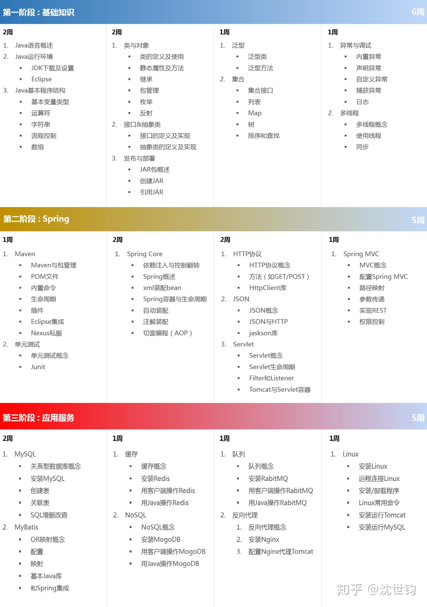

大概1年前，我把自己的实践经验整理成几篇文章，目的是帮助后来者高效的学习Java。
在过去的一年里，根据读者的反馈，以及我个人的思考，我觉得有必要基于这些文章，提供给读者一个凝练，且不失细节的“Java学习路线图”。
该路线图在保留了文章的核心架构外，也做了一些优化，包括：
1. 更详细的学习内容。
2. 更精确的学习时间。
3. 优化学习方法，避开前端知识。
4. 及时引入Jar包管理（Maven）。
下面是具体的 “Java学习路线图”： 

在图中，我把Java学习分成3个阶段：
1. 基础知识
2. Spring
3. 应用服务
阶段划分的原则是“由浅入深”，利于读者层层递进的学习。
内容选编的原则是 “有用”，有利于读者理解Java原理，对实际工作有用。
下面是各个阶段的简要介绍。
基础知识
学习Java基础知识，可供选择的书很多，但它们大都有着一个缺点，那就是内容庞杂，有些内容脱离实际，甚至是过时。
对此，在这一阶段，我精选了Java的基础知识，核心原则就是“有用”。并调整了章节顺序，从而有利于读者循序渐进的学习。
关于学习资料，我建议阅读《Java核心技术 卷I》，并辅于上网搜索。
Spring
目前，Spring已经成为Java开发的基础设施，是任何一个Java程序员都必须掌握的内容。因此，在掌握了Java基础知识后，接下来应转入Spring的学习。
但在正式开始学习Spring之前，还有两个问题要解决：
1. Spring相关jar包的管理。
2. 测试程序的编写及管理。
所以，在正式接触Spring知识之前，路线图首先安排了 Maven和Junit的学习。
Maven和Junit，从实用角度看都不难理解，上网搜索就可以满足学习的需要。
Spring的学习又分为两个阶段：Spring Core和Spring MVC。
Spring MVC是建立在Spring Core之上，在Web MVC领域的具体应用。因此，在学习Spring MVC之前，除了学习Spring Core，还必须掌握与Java Web相关的知识，其中最核心的就是Servlet。
在通常的Java学习中，会建议学生要掌握一定的前端知识，从而便于对Spring MVC进行测试。但前端知识庞杂，且边界不好界定，从而就给Java学习者带来很大的负担。
为此，在本学习大纲中，借鉴与行业通用做法，我推荐学生通过junt和HttpClient组合，用单元测试来满足Spring MVC的测试需求。
这样，在Java学习中，就完全避免了对前端知识的接触，极大的提高了学习效率。
特别提醒一下，Spring是Java学习中最难的部分。但是，一旦跨过这个门槛，从此之后，你基本就踏上了Java学习的通途。因此，对Spring学习一定有决心，要敢于迎难而上，不轻言放弃。
关于Spring的学习资料，我推荐《Spring实战》，虽然我个人对它并不十分满意，但已是我读过的最好的书。阅读的过程中，真遇到不理解的东西，记着随时上网搜索。
应用服务
在这一部分，我列举了Java开发中最常用的“中间件”。这些中间件涵盖了各个领域，包括持久化、缓存、队列、反向代理等。
其中列举的东西，虽然涉及广泛，但内容都相对独立，难度也有限。因此通过上网搜索，就可以满足学习的需求。
在掌握了这些中间件之后，你就会成长为一个能够独立编写Java后端程序，并对架构有一定理解的初级Java软件工程师。
最后，我想说的是，该“Java学习路线图”完全来自于我的一线开发经验，学习的节奏也经过实践的检验。因此，后来者只需“按图索骥”，自会以最少的投入，取得最好的学习效果。
祝你学习顺利！

来自 <https://zhuanlan.zhihu.com/p/84032726> 
