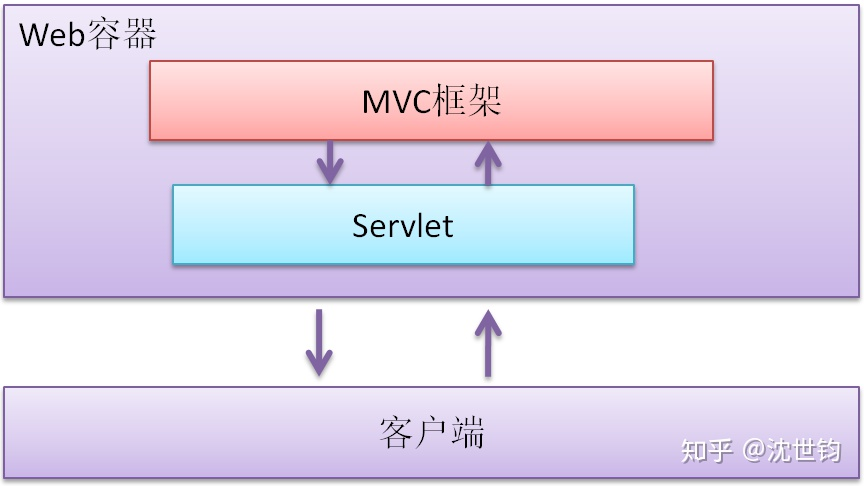

# 写在前面
此repository 是我个人在学习Java过程中的学习笔记，书本推荐《Java核心技术》，笔记仅做提醒记忆功能，更详细的还请阅读原书。
本repository 所有内容是在知乎大佬推荐的基础上建立的，下面会转载大佬的几篇核心文章，此外另外一篇Java学习路线.md是学习路线的总纲，其余的*.md是笔记本体。
各文件夹是我学习过程中的demo，主要是《Java核心技术》书本附带的源码，部分《疯狂Java讲义》附带源码，加之自己编写的一些源代码。
本repository 可以直接clone到IDEA中，其中由于时间问题，加之其他的一些情况，比如我懒，会出现一些小谬误。后期或许会改进，大概。

----

挑基础的，实用的，难理解的讲。至于其他边边角角的知识，就一笔带过。一则没有时间，二则不常用，再则即使讲了，学生印象也不深刻。总之一句话：“好钢用在刀刃上”。
下面，就根据我的实践，具体谈下学习过程：

# 基础知识
我学习java的时候，先是通读了《Java编程思想》，然后是《Java核心技术》。当时这两本书还不像现在这么厚，而刚才我把案头的《Java核心技术》第9版翻了翻，上下两册已经1700多页了，可想而知，如果要把它通读一遍，且不说把所有的代码都调通，就是当小说读，估计也需要些时间。
但我现在教学依然首推《Java核心技术》，主要是体系完整，实例多，可操作性强。但对初学者，我一般是只讲前6章，也就是下面的内容：
****
1. Java程序设计概述
2. Java程序设计环境
3. Java的基础程序设计结构
4. 对象与类
5. 继承
6. 接口与内部类
****
就《Java核心技术》第9版来说，也就是到250页为止，加把劲，1个月拿下完全没问题。
因为你是自学，所以建议你一定要把其中的代码都调通，课后的作业尽量去做。除此之外，还有两点特别重要：
## 学习笔记
因为你是自学，不像在企业中学了就能够实践，印象自然特别深刻。而自学因为没有实践的及时反馈，所以记笔记就显得特别重要。因为记笔记就像写作一样，是整理思路的绝佳方法。同时学习笔记也是你以后开发，面试的绝好资料。
学习编程，人跟人是不一样的，别人觉得难理解的东西，对你却不一定；而你觉得难理解的东西，别人可能又会觉得特简单。而学习笔记就是自己专有的“难点手册”，有点像高考时的“错题本”，以后无论是在面试前，还是在日常工作中，随时都可以翻出来看看，自是获益匪浅。
## 分门别类保存demo
学习笔记是很好的文字资料，但编程界有句话说的特别好，所谓“no code, no text”，意思就是说：千言万语都没有一段代码来的实在。
以我的经验，在你在学习的过程中，就某个知识点，无论当时理解的多透彻，调试的多棒，只要时间一长，等到了实用的时候，肯定会碰到各种各样的问题，一些看似简单的东西，此时死活就是调不通，正所谓人到事中迷。这个时候，如果你手头恰有运行良好的demo，打开参考一下（甚至直接拷贝过来），问题自然迎刃而解。而且因为这些demo都是你亲手调试出来，印象自然特别深刻，一碰到问题，在脑子中自会立刻涌现。
所以说，在学习的过程，一定要善待你调通的demo，千万不要用完了就扔，等后来碰到困难，想要用时却找不到，追愧莫及。正确的做法就是把所有调通的demo，分门别类的保存起来，到时候查起来自是得心应手。
人都说“书到用时方恨少”，其实代码也是这样，所谓“demo用时方恨少”。

# Spring
目前在Java EE开发中，Spring已经成为和Java核心库一样的基础设施，所以说如果想成为一个合格的Java程序员，Spring肯定绕不开。另一方面，如果掌握了Spring体系，Java基本上就算入门了，就有能力进行一些实用级的开发了。
但Spring本身也是日渐复杂，衍生项目越来越多，但最最核心的概念依旧是IOC和AOP，掌握了这两个概念，再把Spring MVC学会，再学习其他的衍生项目就会平滑很多。
同时，因为Spring本身就应用了许多优雅的设计理念，所以学习Spring的过程，也是加强Java基础知识学习的过程。因此等你掌握了Spring，原来很多你理解不透彻的Java特性，此时就会恍然大悟，包括接口、抽象类等。
我学习Spring，读的第一本书是《Spring实战》，坦率的说，书很一般，但市面上比它好的书，我却没有遇到过。还有一本《Spring源码深度解析》也不错，对Spring的设计理念讲的尤其透彻，虽然整本书读起来有些艰涩，但前几章却生动有趣，也是整本书的精华。所以建议你在学习Spring之前，先把该书的前几章通读一下，然后再回过头来学习《Spring实战》会顺利很多。
以我经验，要学透Spring，终极的方法还是阅读源码（我当时就是这么干的），待把Spring的核心源码通读了，人就真的自由了（所谓无真相不自由），不仅是对Spring，而是对整个Java体系。以后再遇到其他框架，大概一眼就能看出其中的脉络，所谓到了“看山不是山”的境界。但这都是后话，可以作为以后你努力的方向。
和学习Java基础知识一样，学习Spring也一定要记笔记，一定要分门别类保存demo。
老实说，Spring对初学者不算简单，因此最好能有个好老师带一下，不用太长时间，2个课时即可，然后就是在你遇到大的困难时，能及时的点拨下。
以我的经验，要初步掌握Spring，大概需要1到1个半月的时间。
# 其他知识
Spring是Java编程的基础设施，但真要进入到实际项目的开发，还有些东西绕不过，包括 MySql，Mybatis，Redis，Servlet等，但如果你经过Spring的洗礼，这些东西相对就简单多了，以我的经验，1个月的时间足够了。
# 实践
学习Java，光学不练肯定是不行的。但因为是自学，所以就没有实际的产品让你练手，但也没有关系，谁大学还没有做过毕业设计呢？以我的经验，大家最爱的“学生管理系统”依旧是个很好的练手系统。
别看“学生管理系统”逻辑简单，但麻雀虽小五脏俱全，其中数据库设计、Mybatis，Spring、SpringMVC，Servlet、Tomcat一个都不缺，绝对的练手好伴侣。
还有，虽然你的学习重点在Java，因为要做一个完整的demo，前端的配合肯定少不了。因此就免少不了要学一些简单的JS、HTML知识，但因为前端本就是个很大的topic，所以一定要控制好边界，千万不要顾此失彼。就“学生管理系统”来说，在前端上，只要实现一个包含table、textbox、button，能发送REST请求到server，能实现学生的“增删改查”的简单页面即可。
作为一个练手项目，目标就是把Java的主要技能点串起来，所以自不求尽善尽美（也不可能），所以1个月时间足够了。
# 最后
按照上面的过程，4个月的时间刚刚好。当然Java的体系是很庞大的，还有很多更高级的技能需要掌握，但不要着急，这些完全可以放到以后工作中边用别学。
学习编程就是一个由混沌到有序的过程，所以你在学习过程中，如果一时碰到理解不了的知识点，大可不必沮丧，更不要气馁，这都是正常的不能再正常的事情了，不过是“人同此心，心同此理”的暂时而已。
在日常的教学中，我常把下面这句话送给学员们，今天也把它送给你：
“道路是曲折的，前途是光明的！”
祝你好运！

来自 <https://www.zhihu.com/question/50904128> 

本文，我主要谈一下那些Java知识“已经过时”，没必要继续学习了。您也可以把本文看做上篇文章的补充。
我判断的依据主要有以下几点：
----
1. 实际开发能否用到？
2. 是否有助于加深对技术的理解？
3. 对面试是否有用？
----
# JSP
JSP在实际开发中，主要是作为MVC模型中的V（View）层出现的。当然，View层的渲染技术除了JSP，还有FreeMaker、Velocity等。
JSP作为页面模板，在后端通过MVC框架渲染成HMTL，然后再发送到客户端（例如浏览器）来呈现。这也就是我们常说的“前后端不分离”，“混合式”开发。
而当前，包括我所在的公司，以及大部分互联网公司。要么已经抛弃这种模式，要么正在抛弃的路上，而转向彻底的“前后端分离”。
在“前后端分离”模式下，后端只负责提供服务接口（例如REST），而前端（例如HTML5）通过接口发送/获取，呈现数据（例如JSON格式）。
这样，在后端，原来的MVC框架，某种意义上已经演变为MC框架。因此，与V（View）相关的一切模板技术都失去了学习的必要，其中当然也包括JSP。所以，后来的Java学习者，我的建议是：
“完全可以放弃对JSP的学习。”
# Struts

在Java后端开发中，MVC模型还是主流。而Struts作为一个MVC框架，单从技术上来说，还是很优秀的。
但是，现在Spring实在是太强势了，越来越成为Java开发中的“一站式”工具包，其中的一个利器就是Spring MVC。
望名知意，Spring MVC也是一个MVC框架。而且因为它是Spring的亲儿子，自然和Spring契合的非常完美。
同时，在设计之初，Spring MVC就参照了其他MVC框架的优缺点（包括Struts），所以用起来非常爽。因此，在MVC框架领域，Spring MVC大有一统天下的趋势。
因此现在，很多公司，老的Struts项目还在维护。但新的项目开发，更多转向了Spring MVC。因此，如果你是Java新手，正在学习中，我的建议是:
“不要再学习Struts了，从Spring MVC开始吧！”
# Hibernate

Hibernate作为老牌的OR映射框架，功能非常强大，涵盖面非常广。但这既是它的优点，同时也成为它的“负担”，是开发人员“不能承受之重”。
Hibernate的设计初衷，是为了最大程度的解放程序员，完全隔离数据库，实现彻底的OR映射。程序员甚至可以不写一行SQL语句，单通过配置就能实现对数据库的操作。
当然，为了实现这个目标，Hibernate也设计的非常复杂、非常精巧。就不可避免的带来以下副作用：
----
1. 学习成本高
2. 配置复杂
3. 调优困难
----
前两点不难理解，单说“调优困难”。
因为Hibernate的设计目标是彻底的OR映射，彻底的隔离SQL语句。但必然会带来一定的性能损失。大部分情况下，应用如果对性能不敏感，Hibernate也没问题。但应用一旦对性能敏感，有SQL级别调优的需求，Hibernate的优点反而成为缺点。
虽然Hibernate也支持SQL级别的调优，但因为框架设计的过于复杂和精巧，这就需要开发人员对Hibernate理解的非常透彻，这就带来了更高的学习成本。
而现在最流行的MyBatis，作为一个“混合式”，轻量级OR映射框架，既继承了Hibernate的优点，同时也吸取了他的教训。在支持配置的同时，又能接触SQL，从而带来了更多灵活性（包括调试、优化）。
当前，在实际开发中，Hibernate使用的越来越少了。大家更偏爱MyBatis这种轻量级框架。所以，对后来学习者，我的建议是：
“不需要再学习Hibernate了，学MyBatis就够了。”
# Servlet（要精通）
当然，现在不会有任何公司，再用纯粹的Servlet来时实现整个Web应用，而是转向一些更高级的技术（例如各种MVC框架）。因此，会给人一种错觉：Servlet已经过时，后来者就不需要再学习了。
在这里，我可以非常负责任的说：这种观点是极端错误，极端不负责任的。
Servlet不仅要学，而且要学深，学透。
当前，Servlet虽然不再是一个主流web开发技术，但依然是Java Web开发技术的基础，是Java Web容器的基石，是行业标准。而现在流行的各种MVC框架（包括SpringMVC），在最底层，还是以 Servlet为基础的。
为此，我画了一个简单的图（不准确，会意即可）：

所以，如果你想要彻底掌握某个MVC框架，则必须彻底理解Servlet。
而且，Servlet作为一个基础设施。精通它，不仅有助于理解各种MVC框架。即使Servlet本身，也有很多实用价值。
如果你深刻理解了Servlet的生命周期，就可以在底层做很多事情。譬如在Request进来的时候，进行拦截，进行权限的判定。也可以在Response发出的时候，进行拦截，统一检查、统一附加。
所以，如果你正在学习Java，对Servlet，我的建议是：
“Servlet不仅要学，而且要学深，学透。”
# 其他
目前在国内，Java更多是作为web后端技术出现的。因此在实际学习中，很多技术就不符合“国情”，学习的现实意义不大。下面我就简单列举下。

----
1. Applet
作为页面插件技术，不用多说，连flash都快被淘汰了，更无论从未流行的applet。
2. Swing
作为桌面UI框架。且不说本身设计的咋样。现实开发中，我接触的桌面应用，要么用C++（例如MFC），要么用C#（Winform、WPF）。所以，Swing就没有学习的必要了。
3. JDBC
作为较低层的数据库基础设施，JDBC被很多框架（例如MyBatis）支持。但在实际开发中，程序员即使不了解也无大碍。因此，虽然我不能建议你放弃JDBC学习，但如果你时间有限，完全可以把它的优先级排低一点。
4. XML
XML现在还在广泛应用。但作为一个web数据传输格式，正在逐渐被JSON替代。所以，对Java后端学习来说，XML简单了解即可。至于庞杂的XML操作API（例如XPath），完全不必学习。将来真要用到，再查也不迟。
----
来自 <https://www.zhihu.com/question/305924723> 

